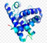
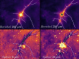

**Multi-Learn** is a **Multiple Learning** focused organization that gathers multiple projects developed as a result of close international collaboration.  
Originally focused on **multi-view learning**, the Multi-Learn project now embraces a broader scope, encompassing diverse learning paradigms including **large-scale single-image learning**, **segmentation**, and **multi-modal approaches**.
---

# From Multi-View to Multiple Learning Strategies

**Multi-Learn** is a research and development initiative that explores a wide spectrum of learning paradigms in machine learning;
with a historical focus on **multi-view learning**. Today, **Multi-Learn** encompasses a broader set of challenges including multimodal integration, synthetic data generation, single-image learning, and large-scale segmentation.
It serves as a hub for interoperable tools and benchmarks designed to support reproducible research and scalable machine learning workflows. Key software and datasets developed under **Multi-Learn** it now addresses broader challenges such as:

- **Multimodal integration**
- **Synthetic data generation**
- **Single-image learning**
- **Large-scale segmentation**

It serves as a hub for **interoperable tools** and **reproducible benchmarks**, enabling scalable ML workflows.

## 🧰 Key Projects and Resources

###  **Summit** (*Supervised MultiModal Integration Tool*): A framework to benchmark mono- and multi-view classifiers on custom datasets. [repo summit](https://github.com/multi-learn/summit)
---
###  **scikit-multimodallearn**: A Python package (scikit-learn compatible) for multimodal data classification. [repo multimodallearn](https://github.com/multi-learn/scikit-multimodallearn)
---
###  **MAGE** (*Multi-view Artificial Generation Engine*): A toolkit to generate synthetic multi-view datasets for controlled experimentation. [repo MAGE](https://github.com/multi-learn/mage)
---
###  **Multimodal Protein Dataset**: A dataset and toolkit for classifying highly multi-functional proteins using multimodal biological data. [repo Protein Dataset](https://github.com/multi-learn/muppi_neurips)
---
###  **LIS²** (*Large Image Split Segmentation*): A toolbox for large-scale, single-image semantic segmentation. [repo LIS²](https://github.com/multi-learn/lis2)
---

**Multi-Learn** brings together these tools to support the **design**, **evaluation**, and **comparison** of learning strategies across real and simulated datasets, and across a variety of modalities and learning tasks.

### 🤝 Collaborating Institutions

- [ULaval](https://www.ulaval.ca/)'s [**GRAAL**](https://graal.ift.ulaval.ca/)
- [AMU](https://www.univ-amu.fr/)'s LIS machine learning team [**Qarma**](https://qarma.lis-lab.fr/)
- [ARCHIMEDE](https://labex-archimede.univ-amu.fr/)'s Development team [**ValoCell**](https://dev.pages.lis-lab.fr/cellule_developpement/)
- [CHUQ](https://www.chudequebec.ca/accueil.aspx)'s omics-oriented team [**Corbeil Lab**](https://corbeillab.genome.ulaval.ca/)
- [LAM](https://www.lam.fr/)'s Laboratoire d'Astrophysique de Marseille - Learning Projects [**BigSF**](https://people.lam.fr/zavagno.annie/big_data_and_machine_learning.html)
- [TAGC](https://tagc.univ-amu.fr/)'s Theories and Approaches of Genomic Complexity [gihub TAGC](https://github.com/TAGC-Inserm)
